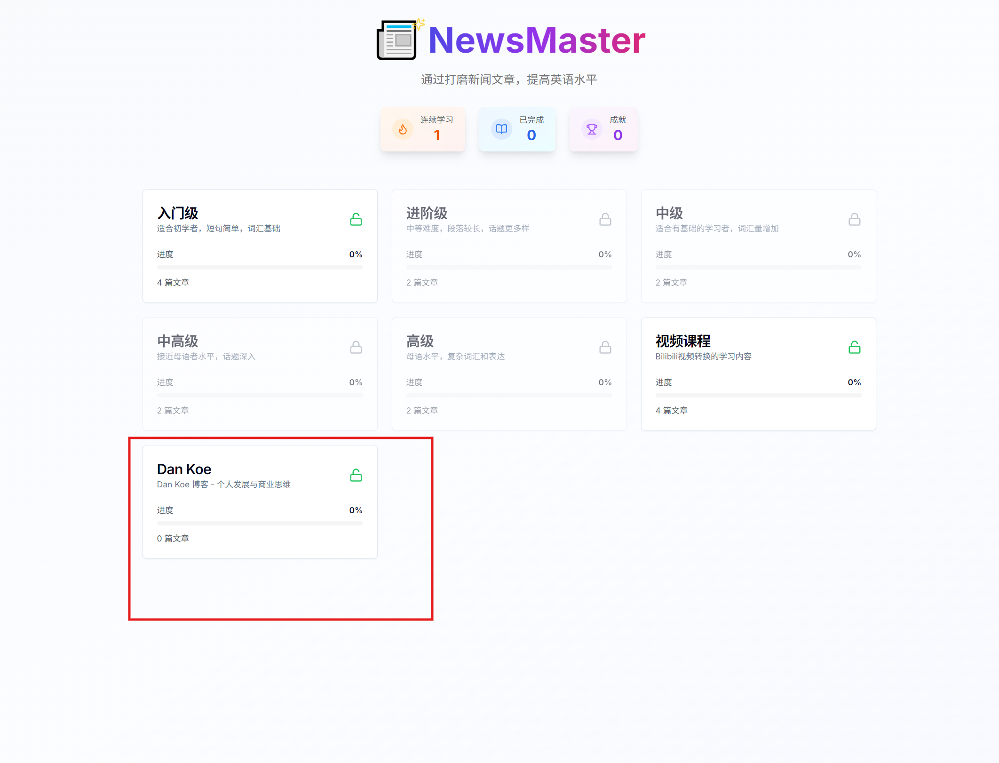
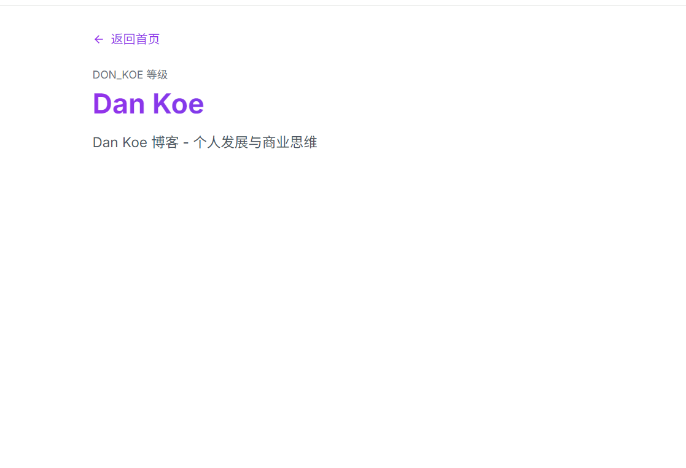

# Bilibili 视频集成方案 - 详细计划

## 待办清单

- [x] 1. 完善 bilibili-downloader.ts 脚本
- [x] 2. 创建 qwen-converter.ts 脚本（使用 Qwen API 转换内容）
- [x] 3. 修改 DataStore 移除 data-storage 持久化
- [x] 4. 修改 ProgressStore 确保 VIDEO 等级无需解锁
- [x] 5. 修改 LevelClient 处理 VIDEO 等级的解锁逻辑
- [x] 6. 修改 ArticleClient 支持真实音频播放
- [x] 7. 创建 public/audio/ 目录结构
- [x] 8. 测试完整流程

---

## 1. 脚本架构

### 1.1 bilibili-downloader.ts（完善现有脚本）

**功能**：
- 接收 Bilibili 视频 URL
- 使用 yt-dlp 下载视频
- 使用 FFmpeg 提取音频（MP3 格式）
- 使用 FFmpeg 提取字幕（VTT 格式）
- 保存音频到 `public/audio/[video-id].mp3`
- 返回字幕文本和视频元数据

**输入**：
```typescript
interface BilibiliInput {
  url: string
  videoId: string  // 用于文件命名，如 "BV1eBkYB9EQJ"
}
```

**输出**：
```typescript
interface BilibiliOutput {
  videoId: string
  title: string
  description: string
  subtitles: string  // 合并后的字幕文本
  audioPath: string  // public/audio/[videoId].mp3
  duration: number   // 视频时长（秒）
}
```

**关键步骤**：
1. 验证 yt-dlp 和 FFmpeg 是否已安装
2. 下载视频到临时目录
3. 提取音频：`ffmpeg -i video.mp4 -q:a 0 -map a audio.mp3`
4. 提取字幕：`ffmpeg -i video.mp4 subtitle.vtt`
5. 解析 VTT 字幕为纯文本
6. 清理临时文件
7. 返回结果

### 1.2 qwen-converter.ts（新建脚本）

**功能**：
- 接收 Bilibili 下载的字幕和元数据
- 调用 Qwen API 将字幕转换为结构化学习内容
- 生成 Article 格式的 JSON

**输入**：
```typescript
interface QwenConverterInput {
  videoId: string
  title: string
  description: string
  subtitles: string
  duration: number
}
```

**Qwen API 调用**：
- 模型：`qwen-plus` 或 `qwen-turbo`
- 任务：将字幕转换为英文学习内容
- 输出格式：JSON（Article 格式）

**Prompt 设计**：
```
你是英语学习内容生成专家。

将以下视频字幕转换为结构化的英语学习内容。

视频标题：{title}
视频描述：{description}
字幕内容：{subtitles}

请生成以下 JSON 格式的内容：
{
  "id": "video-{videoId}",
  "title": "...",
  "description": "...",
  "difficulty": 1-5,
  "english": "完整的英文内容（段落形式）",
  "chinese": "完整的中文翻译（段落形式）",
  "sentences": [
    {"english": "...", "chinese": "..."},
    ...
  ],
  "vocabulary": [
    {"word": "...", "translation": "...", "phonetic": "...", "partOfSpeech": "..."},
    ...
  ]
}

要求：
1. difficulty 根据词汇难度评估（1=A1, 2=A2, 3=B1, 4=B2, 5=C1）
2. sentences 包含 10-20 个关键句子
3. vocabulary 包含 15-30 个关键词汇
4. 确保内容准确、自然、适合学习
```

**输出**：
```typescript
interface Article {
  id: string
  title: string
  description: string
  difficulty: number
  english: string
  chinese: string
  sentences: Array<{ english: string; chinese: string }>
  vocabulary: Array<{
    word: string
    translation: string
    phonetic: string
    partOfSpeech: string
  }>
}
```

### 1.3 video-to-article.ts（主脚本）

**功能**：
- 协调 bilibili-downloader 和 qwen-converter
- 将生成的 Article 保存到 `public/data/VIDEO/articles.json`
- 支持批量处理多个视频

**使用方式**：
```bash
npm run video:convert -- --url "https://www.bilibili.com/video/BV1eBkYB9EQJ/" --video-id "BV1eBkYB9EQJ"
```

**流程**：
1. 调用 bilibili-downloader 下载视频和提取字幕
2. 调用 qwen-converter 转换为 Article
3. 读取现有 `public/data/VIDEO/articles.json`
4. 追加新 Article 到数组
5. 保存回文件
6. 输出成功信息

---

## 2. 数据存储结构

### 2.1 public/audio/ 目录

```
public/audio/
├── BV1eBkYB9EQJ.mp3
├── BV1eBkYB9EQK.mp3
└── ...
```

**命名规则**：`{videoId}.mp3`

### 2.2 public/data/VIDEO/articles.json

```json
{
  "articles": [
    {
      "id": "video-BV1eBkYB9EQJ",
      "title": "...",
      "description": "...",
      "difficulty": 2,
      "english": "...",
      "chinese": "...",
      "sentences": [...],
      "vocabulary": [...],
      "audioPath": "/audio/BV1eBkYB9EQJ.mp3"
    },
    {
      "id": "video-BV1eBkYB9EQK",
      "title": "...",
      "description": "...",
      "difficulty": 3,
      "english": "...",
      "chinese": "...",
      "sentences": [...],
      "vocabulary": [...],
      "audioPath": "/audio/BV1eBkYB9EQK.mp3"
    }
  ]
}
```

**关键点**：
- 每个 Article 包含 `audioPath` 字段指向音频文件
- 支持无限数量的视频文章

---

## 3. 代码修改

### 3.1 types/index.ts

**修改**：在 Article 接口中添加可选的 `audioPath` 字段

```typescript
interface Article {
  id: string
  title: string
  description: string
  difficulty: number
  english: string
  chinese: string
  sentences: Array<{ english: string; chinese: string }>
  vocabulary: Array<{
    word: string
    translation: string
    phonetic: string
    partOfSpeech: string
  }>
  audioPath?: string  // 新增：音频文件路径
}
```

### 3.2 lib/data-store.ts

**修改**：
- 移除 `data-storage` 持久化（只保留 progress-storage）
- 每次加载都从 JSON 文件获取最新数据
- 不使用 persist 中间件的 data-storage 部分

**关键改动**：
```typescript
// 移除 data-storage 的 persist 配置
// 改为每次都从 fetch 加载
const useDataStore = create<DataState>((set) => ({
  levels: [],
  achievements: [],
  loadData: async () => {
    // 直接 fetch JSON，不从 localStorage 读取
    const levels = await Promise.all([
      fetch('/data/A1/articles.json').then(r => r.json()),
      fetch('/data/A2/articles.json').then(r => r.json()),
      // ... 其他等级
      fetch('/data/VIDEO/articles.json').then(r => r.json()),
    ])
    set({ levels: levels.map(/* 转换为 Level 对象 */) })
  },
}))
```

### 3.3 lib/progress-store.ts

**修改**：
- 确保 VIDEO 等级始终解锁
- 不需要前置文章完成

**关键改动**：
```typescript
const isLevelUnlocked = (levelId: string) => {
  if (levelId === 'VIDEO') return true  // VIDEO 等级始终解锁
  // ... 其他等级的解锁逻辑
}
```

### 3.4 app/level/[level]/page.client.tsx

**修改**：
- 处理 VIDEO 等级的文章解锁逻辑
- VIDEO 等级下所有文章都应该解锁

**关键改动**：
```typescript
const isArticleUnlocked = (index: number) => {
  if (levelData?.id === 'VIDEO') return true  // VIDEO 等级所有文章都解锁

  if (index === 0) return true  // 其他等级第一篇自动解锁
  const prevArticleId = levelData?.articles[index - 1].id
  return !!prevArticleId && !!articleProgress[prevArticleId]?.completed
}
```

### 3.5 components/audio-player.tsx

**修改**：
- 支持真实音频文件播放
- 保留 Web Speech API 作为备选

**关键改动**：
```typescript
interface AudioPlayerProps {
  text?: string  // Web Speech API 文本
  audioPath?: string  // 真实音频文件路径
  speed?: number
}

export function AudioPlayer({ text, audioPath, speed = 1 }: AudioPlayerProps) {
  const audioRef = useRef<HTMLAudioElement>(null)

  if (audioPath) {
    // 使用真实音频文件
    return (
      <audio
        ref={audioRef}
        src={audioPath}
        controls
        style={{ playbackRate: speed }}
      />
    )
  }

  // 降级到 Web Speech API
  return <SpeechSynthesisPlayer text={text} speed={speed} />
}
```

### 3.6 app/article/[article]/page.client.tsx

**修改**：
- 在三种学习模式中使用真实音频（如果存在）
- 优先使用 `article.audioPath`，降级到 Web Speech API

**关键改动**：
```typescript
// 在 Listening Mode 中
<AudioPlayer
  audioPath={article.audioPath}
  text={article.english}
  speed={speed}
/>
```

---

## 4. 环境配置

### 4.1 .env.local

**新增**：
```
QWEN_API_KEY=your_qwen_api_key_here
QWEN_API_BASE=https://dashscope.aliyuncs.com/compatible-mode/v1
```

### 4.2 package.json

**修改 scripts**：
```json
{
  "scripts": {
    "video:convert": "tsx scripts/video-to-article.ts"
  }
}
```

---

## 5. 依赖安装

**需要的工具**（系统级）：
- `yt-dlp`：下载 Bilibili 视频
- `ffmpeg`：提取音频和字幕

**需要的 npm 包**：
- `axios` 或 `node-fetch`：调用 Qwen API
- 可能需要 `dotenv`：读取环境变量

---

## 6. 工作流示例

### 6.1 添加新的 Bilibili 视频

```bash
# 1. 运行脚本
npm run video:convert -- --url "https://www.bilibili.com/video/BV1eBkYB9EQJ/" --video-id "BV1eBkYB9EQJ"

# 2. 脚本执行流程
# - 下载视频到临时目录
# - 提取音频到 public/audio/BV1eBkYB9EQJ.mp3
# - 提取字幕
# - 调用 Qwen API 转换为 Article
# - 追加到 public/data/VIDEO/articles.json
# - 清理临时文件

# 3. 应用自动加载新数据
# - 用户访问 VIDEO 等级时，自动加载最新的 articles.json
# - 新视频立即可用
```

---

## 7. 关键设计决策

### 7.1 为什么不持久化数据内容？
- 允许随时更新视频内容（修改 JSON 文件）
- 用户下次访问时自动获取最新版本
- 减少 localStorage 占用空间

### 7.2 为什么 VIDEO 等级无需解锁？
- 视频内容多样化，不需要线性学习
- 用户可以自由选择感兴趣的视频
- 提升学习灵活性

### 7.3 为什么使用 Qwen API？
- 自动化内容转换，减少手工工作
- 支持批量处理多个视频
- 生成结构化的学习内容

### 7.4 为什么存储音频文件？
- 提供更好的音质（相比 Web Speech API）
- 支持离线学习（如果配置了 Service Worker）
- 用户体验更好

---

## 8. 潜在风险和权衡

| 风险 | 影响 | 解决方案 |
|------|------|--------|
| Qwen API 调用失败 | 无法转换视频 | 添加重试机制和错误提示 |
| 音频文件过大 | 占用存储空间 | 压缩音频或使用 CDN |
| 字幕提取失败 | 无法获取内容 | 支持手动输入字幕 |
| yt-dlp 被限制 | 无法下载视频 | 支持手动上传视频文件 |

---

## 9. 后续扩展

- [ ] 支持批量下载多个视频
- [ ] 添加视频元数据编辑界面
- [ ] 支持其他视频平台（YouTube、Vimeo 等）
- [ ] 音频压缩和优化
- [ ] 离线学习支持（Service Worker）

